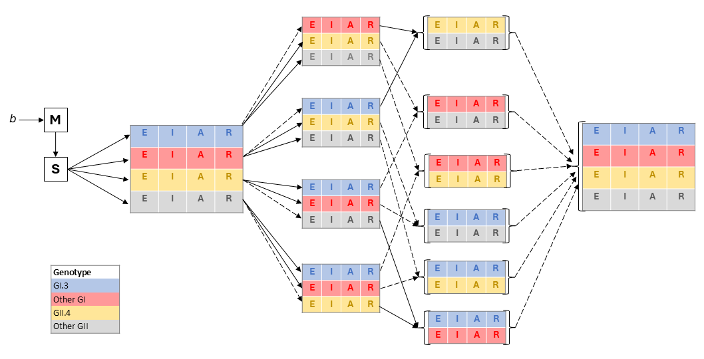

## **The transmission dynamics of Norovirus in England: a genotype-specific modelling study**

[Repository structure and instructions]{.underline}

-   data folder: contains raw which hosts necessary raw data for calibration and input. Stores intermediate objects from "data" type scripts in "R" folder

-   models folder: contains Odin code of the model and model function for calculating likelihood function

-   R folder: contains numbered scripts with all necessary routines. Each script can be run independently as long as necessary dependencies (intermediate objects) have been created beforehand

-   run script: runs the sequential routine of scripts contained in "R"
